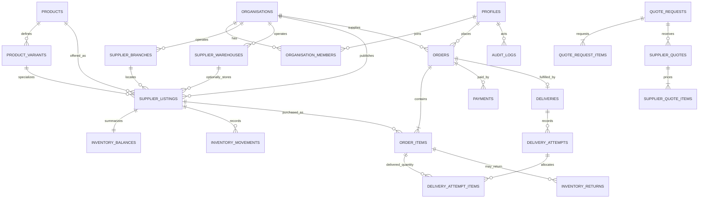

# BuildLink Ghana Entity Relationship Diagram

This diagram summarizes the principal production entities. The SQL migrations remain the authoritative schema.

## Inventory truth

`inventory_movements` is the append-only source of stock changes. `inventory_balances` stores the derived on-hand, reserved and available position. Exact-quantity listings cannot bypass the movement workflow through direct quantity updates.

## Security boundaries

Organisation membership, permissions and row-level security scope supplier and customer data. Cost and valuation fields are additionally masked for users without the relevant finance or inventory-valuation permission.
